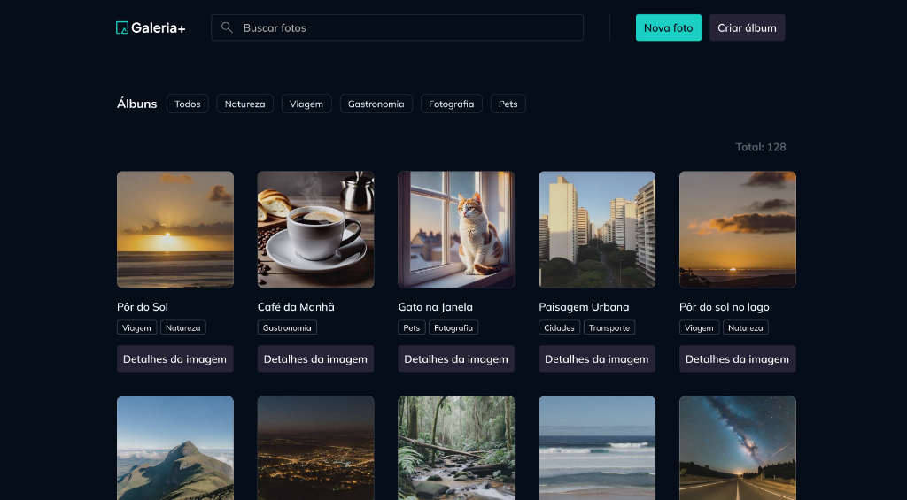
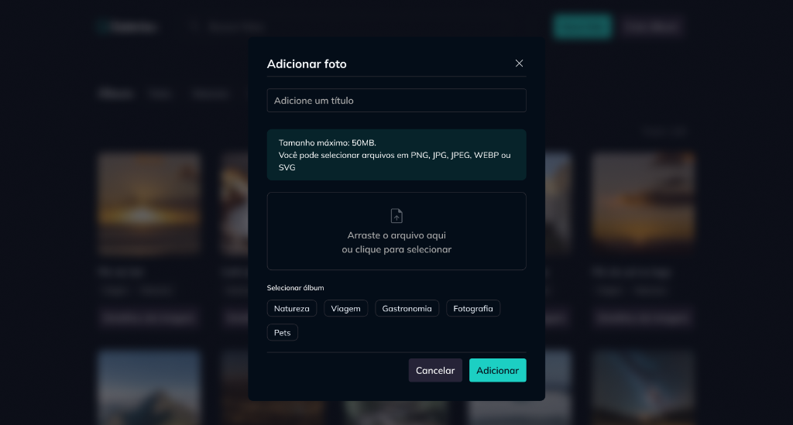
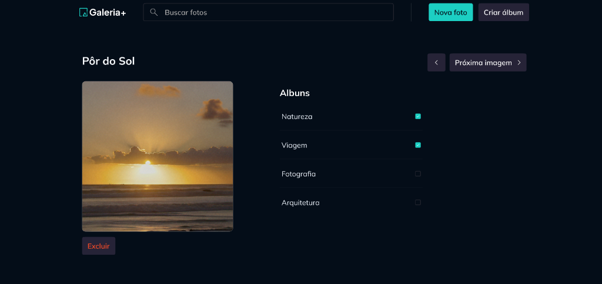

# Gallery+ 📸

O **Gallery+** é uma aplicação web moderna e interativa para gerenciamento de fotos e álbuns. Desenvolvido com uma interface dark premium e fluida, o projeto permite que os usuários enviem fotos, criem álbuns personalizados, associem fotos a múltiplos álbuns de forma dinâmica e recebam feedback instantâneo através de notificações Toast.

Este projeto foi desenvolvido em aula com a **Rocketseat**.

---

## 📸 Demonstração Visual

### Página Inicial (Filtros por Álbum e Listagem de Fotos)


### Modal de Upload e Associação de Nova Foto


### Detalhes da Imagem (Navegação Avançada e Configuração de Álbuns)


---

## 🚀 Funcionalidades

- **Gerenciamento de Fotos**: Adicione novas fotos com títulos personalizados, faça upload direto de arquivos de imagem e exclua fotos existentes.
- **Criação de Álbuns**: Crie novos álbuns e selecione instantaneamente quais fotos do sistema farão parte dele.
- **Associação Dinâmica**: Adicione ou remova fotos de álbuns diretamente na página de detalhes da imagem através de checkboxes interativos.
- **Filtros e Busca**: Busque fotos por título em tempo real e filtre a visualização por álbuns selecionados na barra superior.
- **Sistema de Notificações Toast**: Feedback animado e contextualizado para todas as ações do usuário (sucesso, erro ou informação).

---

## 🛠️ Tecnologias Utilizadas

### Frontend
- **React 19** & **TypeScript**
- **Vite** (Build tool rápido)
- **TanStack React Query v5** (Gerenciamento de estado de requisições e cache)
- **Radix UI** (Componentes de acessibilidade headless para diálogos/modais)
- **React Hook Form** + **Zod** (Validação robusta de formulários)
- **Tailwind CSS** (Estilização utilitária moderna e responsiva)
- **Nuqs** (Sincronização de filtros/busca diretamente na URL da aplicação)

---

## ⚙️ Como Executar o Projeto

### Pré-requisitos
Certifique-se de ter o [Node.js](https://nodejs.org/) e o [pnpm](https://pnpm.io/) instalados em sua máquina.

### Passo 1: Instalar dependências
Execute o comando de instalação no diretório raiz do projeto:
```bash
pnpm install
```

### Passo 2: Executar o Servidor Backend
Abra um terminal e execute o servidor do Fastify:
```bash
pnpm dev-server
```
O servidor estará rodando e pronto para receber requisições de API e upload de imagens.

### Passo 3: Executar o Frontend
Em outro terminal, execute o servidor de desenvolvimento do Vite:
```bash
pnpm dev
```
Abra [http://localhost:5173](http://localhost:5173) no seu navegador para ver e interagir com o Gallery+.

---

## 📂 Estrutura do Projeto

- `/src/components`: Componentes globais e reutilizáveis (botões, inputs, modais).
- `/src/contexts`: Provedores de contexto globais (Toast, hooks e schemas de formulários).
- `/src/contexts/albums` e `/src/contexts/photos`: Componentes, hooks e modelos específicos do domínio de fotos e álbuns.
- `/src/pages`: Estrutura das páginas da aplicação (Home e Detalhes da Foto).
- `/server`: Código-fonte do backend da aplicação.
